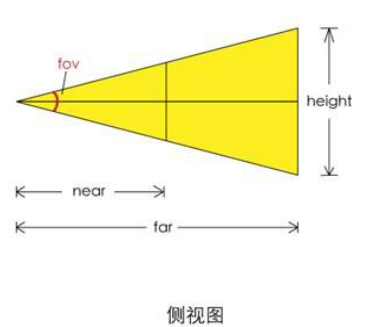

# OrbitControls代码记录

控件执行轨道、缩放和平移

与 TrackballControls 不同， 保持“向上”方向 object.up（默认为 +Y）。

## Constructor

OrbitControls( object : Camera, domElement : HTMLDOMElement )

object: （必须）将要被控制的相机。该相机不允许是其他任何对象的子级，除非该对象是场景自身。

domElement:  用于事件监听器的HTML元素。

```js
const controls = new THREE.OrbitControls( camera, renderer.domElement );
```

## 添加事件监听

```js
scope.domElement.addEventListener( 'contextmenu', onContextMenu );// 鼠标右击
scope.domElement.addEventListener( 'pointerdown', onPointerDown );// 鼠标按下
scope.domElement.addEventListener( 'pointercancel', onPointerCancel );
scope.domElement.addEventListener( 'wheel', onMouseWheel, { // 鼠标滚轮
  passive: false
} ); 

scope.domElement.addEventListener( 'pointermove', onPointerMove ); // 鼠标移动
scope.domElement.addEventListener( 'pointerup', onPointerUp ); // 鼠标抬起
```

**源码中会区分事件类型(触摸事件、鼠标事件)，处理过程大致一样，接下来主要以鼠标事件为主**

### onMouseDown 

**鼠标按下事件**

```js
function onMouseDown( event ) {
			//通过event.button来区分操作状态
				let mouseAction;
				switch ( event.button ) {
					case 0:
						mouseAction = scope.mouseButtons.LEFT;
						break;
					case 1:
						mouseAction = scope.mouseButtons.MIDDLE;
						break;
					case 2:
						mouseAction = scope.mouseButtons.RIGHT;
						break;
					default:
						mouseAction = - 1;
				}
			
				switch ( mouseAction ) {
					// 通过操作状态类别执行相应的事件
					// state为当前的状态
					case THREE.MOUSE.DOLLY:
						if ( scope.enableZoom === false ) return;
						handleMouseDownDolly( event ); //缩放事件
						state = STATE.DOLLY;
						break;

					case THREE.MOUSE.ROTATE:
						if ( event.ctrlKey || event.metaKey || event.shiftKey ) {

							if ( scope.enablePan === false ) return;
							handleMouseDownPan( event );// 移动事件
							state = STATE.PAN;

						} else {

							if ( scope.enableRotate === false ) return;
							handleMouseDownRotate( event );//旋转事件
							state = STATE.ROTATE;

						}

						break;

					case THREE.MOUSE.PAN:
						if ( event.ctrlKey || event.metaKey || event.shiftKey ) {

							if ( scope.enableRotate === false ) return;
							handleMouseDownRotate( event );//旋转事件
							state = STATE.ROTATE;

						} else {

							if ( scope.enablePan === false ) return;
							handleMouseDownPan( event );// 移动事件
							state = STATE.PAN;

						}

						break;

					default:
						state = STATE.NONE;

				}

				if ( state !== STATE.NONE ) {

					scope.dispatchEvent( _startEvent );

				}

			}
```

平移状态: 设置平移偏移量中的panStart

```js
function handleMouseDownPan( event ) {
  panStart.set( event.clientX, event.clientY );
}
```

旋转状态: 设置旋转偏移量中的rotateStart

```js
function handleMouseDownRotate( event ) {
  rotateStart.set( event.clientX, event.clientY );
}
```

缩放状态：设置缩放偏移量中的dollyStart

```js
function handleMouseDownDolly( event ) {
  dollyStart.set( event.clientX, event.clientY );
}
```


以上为鼠标按下事件，主要内容为：

1. 设置(平移、旋转、旋转)偏移量的start分量
2. 设置状态state，主要用来区分当前处于(移动、旋转、缩放)中其中的状态

### onMouseMove

**鼠标移动事件**

通过state状态区分执行相应的事件

```js
function onMouseMove( event ) {

  if ( scope.enabled === false ) return;

  switch ( state ) {

    case STATE.ROTATE:
      if ( scope.enableRotate === false ) return;
      handleMouseMoveRotate( event );// 鼠标移动时旋转
      break;

    case STATE.DOLLY:
      if ( scope.enableZoom === false ) return;
      handleMouseMoveDolly( event );// 鼠标移动时缩放
      break;

    case STATE.PAN:
      if ( scope.enablePan === false ) return;
      handleMouseMovePan( event ); //鼠标移动时平移
      break;

  }

}
```

#### 鼠标移动时平移

1. 设置panEnd分量
2. panEnd分量减去panStart分量得到鼠标移动的距离分离。 乘移动的速度panSpeed(默认为1)
3. 执行pan方法，传入计算得出的平移距离
4. 设置panStart分量为位移后的panEnd分量（下一次新的panEnd再减去panStart就会为下一次的平移距离）

```js
function handleMouseMovePan( event ) {
  panEnd.set( event.clientX, event.clientY );
  panDelta.subVectors( panEnd, panStart ).multiplyScalar( scope.panSpeed );
  pan( panDelta.x, panDelta.y );
  panStart.copy( panEnd );
  scope.update();
}
```

pan方法

初始化相机时默认会区分透视相机（isPerspectiveCamera）和正交相机（isOrthographicCamera）

- 透视相机

  1. 获取到视点位置

  2. 视点位置减去目标点位置为视线

  3. 得到视线长度

     

  4. targetDistance：视线将fov平分，通过正切/2计算截面的高度的一半

  5. targetDistance乘2为裁剪面的高度 **与** canvas高度的比值 **乘以** deltaX(x轴方向的位移量) 就是在截面中的位移量

  6. targetDistance乘2为裁剪面的高度 **与** canvas高度的比值 **乘以** deltaY(y轴方向的位移量) 就是在截面中的位移量

  7. **在这里只使用 clientHeight 所以纵横比不会扭曲速度**

- 正交相机

  1. ( scope.object.right - scope.object.left )为裁剪面的宽度
  2. 裁剪空间的宽度与canvas的比值乘deltaX为在dom中的位移量
  3. scope.object.zoom 为相机的缩放比值

```js
const pan = function () {

  const offset = new THREE.Vector3();
  return function pan( deltaX, deltaY ) {

    const element = scope.domElement;
		// 判断当前为透视相机
    if ( scope.object.isPerspectiveCamera ) {
      
      const position = scope.object.position;//获取到视点位置
      offset.copy( position ).sub( scope.target );//视点位置减去目标点位置为视线
      let targetDistance = offset.length(); //视线长度
      // 视线将fov平分，通过正切/2计算截面的高度的一半
      targetDistance *= Math.tan( scope.object.fov / 2 * Math.PI / 180.0 ); 
      // targetDistance / element.clientHeight为截面与canvas高度的比值
      // 乘deltaX得到在截面中的位移量
      panLeft( 2 * deltaX * targetDistance / element.clientHeight, scope.object.matrix );
      panUp( 2 * deltaY * targetDistance / element.clientHeight, scope.object.matrix );
		
      // 判断当前为正交相机
    } else if ( scope.object.isOrthographicCamera ) {
      // ( scope.object.right - scope.object.left ) 为 裁剪面的宽度
      // dom中的位移量 * 裁剪面的宽度 / 相机的缩放比值 / canvas的宽度
      // 得到裁剪面中的x方向的位移量
      panLeft( 
        deltaX * ( scope.object.right - scope.object.left ) / scope.object.zoom / element.clientWidth, 
        scope.object.matrix
      );
      // ( scope.object.top - scope.object.bottom ) 为 裁剪面的高度
      // dom中的位移量 * 裁剪面的高度 / 相机的缩放比值 / canvas的高度
      // 得到裁剪面中的y方向的位移量
      panUp( 
        deltaY * ( scope.object.top - scope.object.bottom ) / scope.object.zoom / element.clientHeight,
        scope.object.matrix 
      );

    } else {

      // 相机既不是正交也不是透视
      console.warn( 'WARNING: OrbitControls.js encountered an unknown camera type - pan disabled.' );
      scope.enablePan = false;

    }

  };

}();
```

水平x轴平移

```js
const panLeft = function () {

  const v = new THREE.Vector3();
  return function panLeft( distance, objectMatrix ) {
		//ELSL语言中的矩阵是列主序的，所以获取x的坐标就是矩阵中的第一列
    v.setFromMatrixColumn( objectMatrix, 0 ); 
		// 浏览器坐标系与webGL的X轴为同向，所以乘-distance
    v.multiplyScalar( - distance );
    panOffset.add( v );

  };

}();
```

垂直y轴平移

```js
const panUp = function () {

  const v = new THREE.Vector3();
  return function panUp( distance, objectMatrix ) {

    if ( scope.screenSpacePanning === true ) {
			// 获取y的坐标-矩阵中的第二列
      v.setFromMatrixColumn( objectMatrix, 1 );

    } else {
			
      v.setFromMatrixColumn( objectMatrix, 0 );
      // 上方向与x轴的叉乘得到 -z轴
      v.crossVectors( scope.object.up, v );

    }
		// 浏览器坐标系与webGL的X轴为反向，所以乘distance
    v.multiplyScalar( distance );
    panOffset.add( v );

  };

}();
```

####  鼠标移动时旋转

1. 设置rotateEnd分量
2. rotateEnd分量减去rotateStart分量，得到鼠标在页面中移动的距离分量。乘旋转的速度rotateSpeed（默认为1）
3. rotateLeft(水平轴移动的位置对应旋转的角度)
4. rotateUp(垂直轴移动的位置对应旋转的角度)
   1. 计算水平或垂直轴移动的位置对应旋转的角度过程
   2. 2 * Math.PI为 360° 、rotateDelta.x为页面中的位移量、 element.clientHeight为页面的高度
   3. 位移整个高度为 360°，以上就是位移量与页面高度的比值。乘  360°，结果为水平旋转的度数
   4. 垂直旋转量的计算也是如此
   5. 使用 clientHeight 为了保证纵横比不会扭曲速度
5. 设置rotateStart分量为位移后的rotateEnd分量（下一次新的rotateEnd再减去rotateStart就会为下一次的平移距离） 

```js
function handleMouseMoveRotate( event ) {

  rotateEnd.set( event.clientX, event.clientY );
  rotateDelta.subVectors( rotateEnd, rotateStart ).multiplyScalar( scope.rotateSpeed );
  const element = scope.domElement;
  rotateLeft( 2 * Math.PI * rotateDelta.x / element.clientHeight ); // yes, height

  rotateUp( 2 * Math.PI * rotateDelta.y / element.clientHeight );
  rotateStart.copy( rotateEnd );
  scope.update();

}
```
以下为旋转量的计算方式，若不明白为何，需了解球坐标相关内容
```js
function rotateLeft( angle ) {

  sphericalDelta.theta -= angle;

}

function rotateUp( angle ) {

  sphericalDelta.phi -= angle;

}
```

